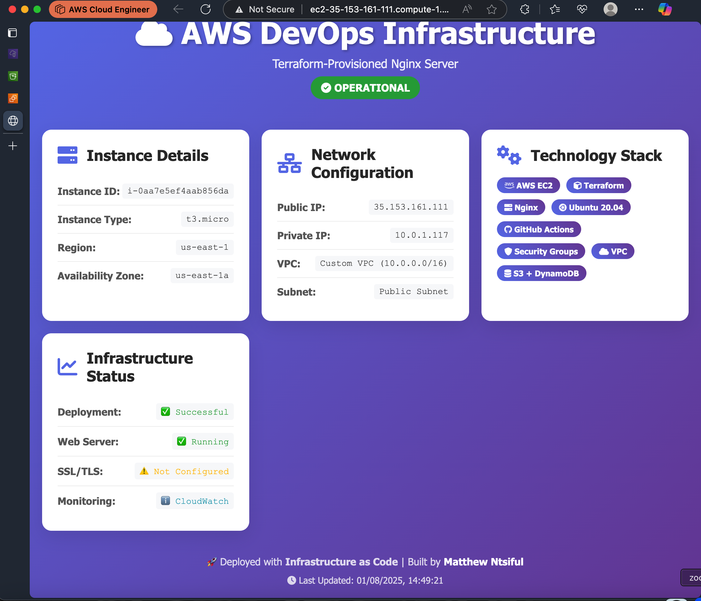

# AWS Terraform Nginx DevOps Stack


## 🚀 DevOps Infrastructure Stack

Production-ready AWS infrastructure demonstrating modern DevOps practices with Infrastructure as Code (IaC), automated CI/CD pipelines, security best practices, and comprehensive monitoring solutions.

**Status**: ✅ **DEPLOYED & OPERATIONAL**

## 📸 Live Demo Screenshots

### Modern Web Interface

*Screenshot of the deployed web UI showing real-time AWS instance metadata with modern dashboard design*

## ✨ Current Infrastructure

### 🏗️ Deployed Resources
- **VPC**: Custom network (10.0.0.0/16) with public/private subnets
- **EC2 Instance**: Ubuntu server with Nginx (t3.small)
- **Security Groups**: Web traffic (HTTP/HTTPS) and SSH access
- **Networking**: Internet Gateway, NAT Gateway, Route Tables
- **Remote State**: Universal S3 bucket with DynamoDB locking
- **SSH Key Pair**: Auto-generated for secure access
- **Modern Web Interface**: Dynamic dashboard with real-time instance data

### 🔄 CI/CD Pipeline Status
- **Status**: ✅ Active and functional
- **Triggers**: Push to main branch or manual dispatch
- **Validation**: Format checking, syntax validation, security scanning
- **Deployment**: Automated infrastructure provisioning
- **Manual Destroy**: Safe destroy with confirmation requirements
- **State Management**: S3 + DynamoDB with automatic lock recovery
- **Dependencies**: Improved job sequencing and error handling

### 🎨 Web Interface Features
- **Modern Dashboard**: Responsive design with gradient backgrounds and animations
- **Real-time Data**: Dynamic instance metadata (ID, type, IPs, region)
- **Interactive Cards**: Hover effects and smooth transitions
- **Technology Stack**: Visual badges showing AWS, Terraform, Nginx, Ubuntu, GitHub Actions
- **Status Monitoring**: Infrastructure health indicators with color-coded status
- **Mobile Responsive**: Optimized for all device sizes
- **Auto-Generated**: Created via user data script with dynamic content

## 🏛️ Architecture & Workflow

### CI/CD Workflow
```
┌─────────────────────────────────────────────────────────────────┐
│                        Developer Workflow                       │
└─────────────────────────────────────────────────────────────────┘
                                  │
                    ┌─────────────▼─────────────┐
                    │     git push origin main  │
                    └─────────────┬─────────────┘
                                  │
┌─────────────────────────────────▼─────────────────────────────────┐
│                      GitHub Actions Pipeline                      │
│                                                                   │
│  ┌─────────────┐  ┌─────────────┐  ┌─────────────┐  ┌──────────┐ │
│  │ terraform   │  │ terraform   │  │ terraform   │  │terraform │ │
│  │    fmt      │→ │  validate   │→ │    plan     │→ │  apply   │ │
│  └─────────────┘  └─────────────┘  └─────────────┘  └──────────┘ │
└─────────────────────────────────────┬─────────────────────────────┘
                                      │
                                      ▼
┌─────────────────────────────────────────────────────────────────┐
│                          AWS Infrastructure                      │
│                                                                 │
│  ┌─────────────────────────────────────────────────────────┐   │
│  │                    VPC                                  │   │
│  │                                                         │   │
│  │  ┌─────────────────┐         ┌─────────────────────┐   │   │
│  │  │  Public Subnet  │         │   Private Subnet    │   │   │
│  │  │                 │         │                     │   │   │
│  │  │ ┌─────────────┐ │   NAT   │                     │   │   │
│  │  │ │    EC2      │ │◄────────┤                     │   │   │
│  │  │ │   (Nginx)   │ │ Gateway │                     │   │   │
│  │  │ └─────────────┘ │         │                     │   │   │
│  │  └─────────────────┘         └─────────────────────┘   │   │
│  └─────────────────────────────────────────────────────────┘   │
│                                                                 │
│  ┌─────────────────────────────────────────────────────────┐   │
│  │              Remote State Management                    │   │
│  │  S3: <terraform-state-bucket>                          │   │
│  │  DynamoDB: <state-lock-table>                          │   │
│  └─────────────────────────────────────────────────────────┘   │
└─────────────────────────────────────────────────────────────────┘
```

### Infrastructure Components
- **Compute**: EC2 instance (t3.small) running Nginx
- **Network**: VPC with public/private subnets, NAT Gateway
- **Security**: Security groups for web traffic and SSH
- **State**: Universal remote backend with S3 and DynamoDB
- **Backend Repository**: Separate `terraform-backend` for centralized state management
- **User Data Automation**: Automated web server setup and modern interface deployment

### 📜 User Data Script Features
The EC2 instance is automatically configured via user data script that:

**System Setup:**
- Installs and configures Nginx web server
- Updates Ubuntu packages and installs utilities (curl, jq)
- Sets up proper file permissions and service management

**Dynamic Web Interface:**
- Fetches real-time instance metadata from AWS metadata service
- Creates a modern, responsive HTML dashboard with:
  - Instance details (ID, type, region, availability zone)
  - Network configuration (public/private IPs, VPC info)
  - Technology stack visualization with icons
  - Infrastructure status monitoring
  - Interactive animations and hover effects

**Professional Presentation:**
- Gradient backgrounds with modern CSS styling
- Font Awesome icons for visual appeal
- Mobile-responsive design
- Real-time timestamp and contact information
- Card-based layout with smooth transitions

## 🌐 Live Demo


*Live demonstration of the interactive web interface*

Once deployed, visit your EC2 instance's public IP to see the modern web interface featuring:
- Real-time AWS instance metadata
- Interactive dashboard with animations
- Technology stack showcase
- Infrastructure status monitoring

## 🚀 Quick Start

### Prerequisites
- **AWS Account** with sufficient permissions
- **GitHub Account** with Actions enabled
- **Git** >= 2.0

### 🎯 Deployment Methods

#### Method 1: Automatic Deployment
- **Trigger**: Push to main branch
- **Process**: Validate → Plan → Apply
- **Use Case**: Regular development workflow

#### Method 2: Manual Deployment
- **Trigger**: GitHub Actions → "Run workflow"
- **Action**: Select "apply"
- **Process**: Validate → Plan → Apply
- **Use Case**: Controlled deployments

#### Method 3: Manual Destroy
- **Trigger**: GitHub Actions → "Run workflow"
- **Action**: Select "destroy"
- **Confirmation**: Type "destroy" in confirmation field
- **Process**: Validate → Backup → Destroy → Cleanup
- **Use Case**: Safe infrastructure removal

### 🔧 Setup Instructions

#### 1. Repository Setup
```bash
git clone https://github.com/matthewntsiful/aws-terraform-nginx-devops.git
cd aws-terraform-nginx-devops
```

#### 2. Configure GitHub Secrets
Navigate to Repository Settings → Secrets and Variables → Actions:
```
AWS_ACCESS_KEY_ID: <your-aws-access-key>
AWS_SECRET_ACCESS_KEY: <your-aws-secret-key>
AWS_REGION: <your-aws-region>
```

#### 3. Deploy Infrastructure

**Automatic (Push to Main):**
```bash
git add .
git commit -m "Deploy infrastructure"
git push origin main
```

**Manual (GitHub Actions):**
1. Go to Actions → "Terraform CI/CD"
2. Click "Run workflow"
3. Select "apply" action
4. Click "Run workflow"

#### 4. Destroy Infrastructure (When Needed)
1. Go to Actions → "Terraform CI/CD"
2. Click "Run workflow"
3. Select "destroy" action
4. Type "destroy" in confirmation field
5. Click "Run workflow"

**Note**: All methods use the same S3 remote state for consistency.

## ⚙️ Configuration Management

### 🌍 Configuration
```hcl
# Configurable via variables.tf
aws_region = "<your-aws-region>"
environment = "<environment>"
instance_type = "<instance-type>"
vpc_cidr = "<vpc-cidr-block>"
public_subnet_cidrs = ["<subnet-cidrs>"]
private_subnet_cidrs = ["<subnet-cidrs>"]
availability_zones = ["<availability-zones>"]
```

### 🗄️ Universal Remote State Backend
```hcl
# Configured in provider.tf
backend "s3" {
  bucket         = "<terraform-state-bucket>"
  key            = "<project-name>/terraform.tfstate"
  region         = "<aws-region>"
  dynamodb_table = "<state-lock-table>"
  encrypt        = true
}
```

**Centralized State Management:**
- **Universal Bucket**: Stores state files for all Terraform projects
- **Project Isolation**: Each project uses a unique key path
- **Shared Infrastructure**: One backend serves multiple projects
- **Cost Efficient**: Single S3 bucket and DynamoDB table

## 🛠️ Operations

### 🚀 Making Changes

#### Via CI/CD Pipeline (Recommended)
```bash
git add .
git commit -m "Update infrastructure"
git push origin main
# → Triggers automatic deployment
```

#### Via Manual Trigger
1. Push changes to repository
2. Go to GitHub Actions
3. Select "Run workflow" → "apply"
4. Monitor deployment progress

#### Local Development (Optional)
```bash
terraform plan    # Preview changes
terraform apply   # Apply changes
```

### 📊 Monitoring
```bash
# Check current infrastructure
terraform state list
terraform show

# View deployment history
# GitHub Actions → Workflow runs

# Access deployed application
terraform output
```

### 🔄 State Management
```bash
# Universal backend for all projects
# State path: <project-name>/terraform.tfstate
# Shared S3 bucket: <terraform-state-bucket>
# Automatic synchronization between local and CI/CD
```

### 🏗️ Backend Architecture
```
terraform-backend/
├── S3 Bucket: <terraform-state-bucket>
│   ├── project-1/terraform.tfstate
│   ├── project-2/terraform.tfstate
│   └── project-n/terraform.tfstate
└── DynamoDB: <state-lock-table>
```

## 📋 Pipeline Workflow Details

### 🔍 Continuous Integration
- **Code Quality**: Terraform format checking with `terraform fmt`
- **Syntax Validation**: Configuration validation with `terraform validate`
- **Security Scanning**: Infrastructure security analysis
- **Plan Generation**: Detailed change impact assessment
- **Dependency Checks**: Jobs only run after successful validation

### 🚀 Continuous Deployment
- **Automated Deployment**: Push to main triggers deployment
- **Manual Triggers**: Workflow dispatch for apply/destroy operations
- **State Synchronization**: Remote state ensures consistency
- **Change Tracking**: Complete audit trail of infrastructure changes
- **Safety Mechanisms**: Confirmation required for destroy operations

### 🛡️ Manual Destroy Workflow
- **Manual Trigger Only**: Prevents accidental infrastructure destruction
- **Double Confirmation**: Must select "destroy" action AND type "destroy"
- **Safety Check**: Blocks operation if confirmation is missing
- **State Backup**: Automatic backup before destruction
- **Dependency Chain**: Validation → Destroy → Cleanup
- **Auto-Recovery**: DynamoDB locks auto-expire to prevent deadlocks

## 🏆 DevOps Best Practices Implemented

### ✅ Achieved
- **Infrastructure as Code**: All infrastructure defined in Terraform
- **Remote State Management**: S3 backend with DynamoDB locking
- **CI/CD Pipeline**: Automated validation and deployment
- **Security**: Encrypted state, secure networking, IAM best practices
- **Version Control**: Git-based infrastructure versioning
- **Environment Consistency**: Same state shared across environments

## 🔧 Troubleshooting

### ✅ Resolved Issues
- **Remote State**: Successfully configured with S3 backend
- **Pipeline Integration**: GitHub Actions workflow operational
- **State Synchronization**: Local and CI/CD environments synchronized

### 🔧 Common Operations

#### Local Commands
```bash
# Format code before committing
terraform fmt

# Validate configuration
terraform validate

# Check state synchronization
terraform state list

# View current outputs
terraform output

# Force unlock stale locks (if needed)
terraform force-unlock <lock-id>
```

#### GitHub Actions Operations
- **Deploy**: Push to main or manual trigger with "apply"
- **Destroy**: Manual trigger with "destroy" + confirmation
- **Monitor**: Check Actions tab for workflow status
- **Troubleshoot**: Review workflow logs for errors

### 🚨 Troubleshooting

#### Common Issues
- **State Lock Conflicts**: Wait 20 minutes for auto-expiry or force unlock
- **Pipeline Failures**: Check GitHub Actions logs for detailed errors
- **AWS Permissions**: Verify IAM policies for S3, EC2, VPC, DynamoDB access
- **Destroy Blocked**: Ensure "destroy" is typed exactly in confirmation field

#### State Lock Recovery
```bash
# If locks are stuck, they auto-expire in 20 minutes
# Or force unlock manually:
terraform force-unlock <lock-id>
```

#### Workflow Dependencies
- All jobs depend on successful validation
- Apply/Destroy only run after terraform job succeeds
- Safety checks prevent accidental operations
- Automatic cleanup after successful operations

## 🤝 Contributing

### 📋 Development Workflow
1. **Fork Repository**: Create personal fork
2. **Feature Branch**: `git checkout -b feature/new-feature`
3. **Development**: Implement changes with validation
4. **Pull Request**: Submit PR with detailed description
5. **CI/CD Pipeline**: Automated testing and validation
6. **Merge**: Automatic deployment after approval

## 📄 License

MIT License - see [LICENSE](LICENSE) file for details.

## 📞 Support & Contact

**Maintained by**: [Matthew Ntsiful](mailto:matthew.ntsiful@gmail.com)

- 🐛 **Issues**: [GitHub Issues](https://github.com/matthewntsiful/aws-terraform-nginx/issues)
- 💬 **Discussions**: [GitHub Discussions](https://github.com/matthewntsiful/aws-terraform-nginx/discussions)
- 📧 **Email**: matthew.ntsiful@gmail.com
- 💼 **LinkedIn**: [Matthew Ntsiful](https://linkedin.com/in/matthew-ntsiful)

---

⭐ **Star this repository if it helped you!**